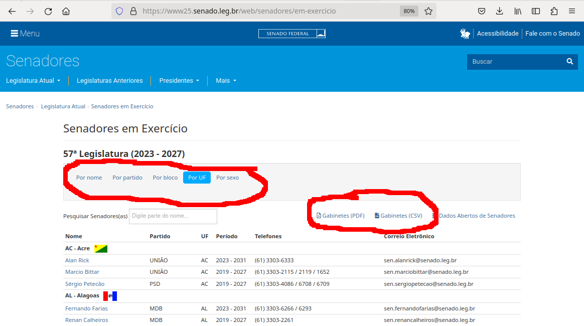

:::::::::::::::::::::::::::::::::::::: questions 

- What is web scraping and why is it useful?
- What are typical use cases for web scraping?

::::::::::::::::::::::::::::::::::::::::::::::::

::::::::::::::::::::::::::::::::::::: objectives

- Introduce the concept of structured data
- Discuss how data can be extracted from web pages
- Introduce the examples that will be used in this lesson

::::::::::::::::::::::::::::::::::::::::::::::::

## What is web scraping?

Web scraping is a technique for extracting information from websites. This can be done
manually but it is usually faster, more efficient and less error-prone to automate the task. 

Web scraping allows you to acquire non-tabular or poorly structured data from websites and
convert it into a usable, structured format, such as a .csv file or spreadsheet.

Scraping is about more than just acquiring data: it can also help you archive data and track
changes to data online.

It is closely related to the practice of
web _indexing_, which is what search engines like Google do when mass-analysing the Web to build
their indices. But contrary to _web indexing_, which typically parses the entire content of a web
page to make it searchable, _web scraping_ targets specific information on the pages visited.

For example, online stores will often scour the publicly available pages of their competitors,
scrape item prices, and then use this information to adjust their own prices. Another common
practice is "contact scraping" in which personal information like email
addresses or phone numbers is collected for marketing purposes.

Web scraping is also increasingly being used by scholars to create data sets for
text mining projects; these might be collections of journal articles or digitised texts. The
practice of [data journalism](https://en.wikipedia.org/wiki/Data_journalism), in particular,
relies on the ability of investigative journalists to harvest data that is not always presented
or published in a form that allows analysis.


## Before you get started

As useful as scraping is, there might be better options for the task. Choose the right
(i.e. the easiest) tool for the job.

- Check whether or you can easily copy and paste data from a site into spreadsheet software. This might be quicker than scraping.
- Check if the site or service already provides an API to extract structured data. If it does, that will be a much more efficient and effective pathway. Good examples are the 
[GitHub API](https://docs.github.com/en/rest/overview/about-githubs-apis?apiVersion=2022-11-28), the [Mastodon APIs](https://docs.joinmastodon.org/client/intro/) or the [YouTube comments API](https://developers.google.com/youtube/v3/docs/commentThreads/list).
- For much larger needs, Freedom of information requests can be useful. Be specific about the formats required for the data you want.

## Example: scraping government websites for contact addresses

In this lesson, we will extract contact information
from government websites that list the members of various jurisdictions. 

Let's start by looking at the current list of members of the South African parliament, which is available
on the [South African parliament website](https://www.parliament.gov.za/group-details).

This is how this page appears in June 2023:

{alt=`Image showing top part of the
South African parliament webite https://www.parliament.gov.za/group-details`}

There are several features (circled in the image above) that make the data on this page easier to work with.
The search, reorder, refine features and display modes hint that the data is actually stored in a (structured)
database before being displayed on this page. The data can be readily downloaded either as a comma separated values (.csv)
file or as XML for re-use in their own database, spreadsheet or computer program.

Even though the information displayed in the view above is not labelled, anyone visiting this site with some
knowledge of South Africa geography and politics can see what information pertains to the 
politicians' names, the geographical area they come from and the political party they represent. This is because human
beings are good at using context and prior knowledge to quickly categorise information.

Computers, on the other hand, cannot do this unless we provide them with more information.
Fortunately, if we examine the source HTML code of this page, we can see that the information displayed
has some structure:

```output
<div class="cell" id="all-members-tabs-wrapper">
      <group-details members='{&quot;a-d&quot;:[{&quot;id&quot;:1,&quot;full_name&quot;:&quot;Phoebe Noxolo Abraham&quot;,&quot;profile_pic_url&quot;:&quot;\/storage\/app\/media\/MemberImages\/1.jpg&quot;,&quot;party&quot;:&quot;ANC&quot;,&quot;province&quot;:&quot;Eastern Cape&quot;,&quot;national&quot;:0},{&quot;id&quot;:2,&quot;full_name&quot;:&quot;Alexandra Lilian Amelia Abrahams&quot;,&quot;profile_pic_url&quot;:&quot;\/storage\/app\/media\/MemberImages\/2.jpg&quot;,&quot;party&quot;:&quot;DA&quot;,&quot;province&quot;:&quot;Western Cape&quot;,&quot;national&quot;:0},{&quot;id&quot;:3,&quot;full_name&quot;:&quot;Rachel Cecilia Adams&quot;,&quot;profile_pic_url&quot;:&quot; ...member-count='450'></group-details>
</div>
      
(...)      
```

Thanks to this structure, we could relatively easily instruct a computer to look for all parliamentarians from
the Northern Cape and list their names and parties.


:::::::::::::::::::::::::::::::::::::::::  callout

## Structured vs unstructured data

When presented with information, human beings are good at quickly categorizing it and extracting the data
that they are interested in. For example, when we look at a magazine rack, provided the titles are written
in a script that we are able to read, we can rapidly figure out the titles of the magazines, the stories they
contain, the language they are written in, etc. and we can probably also easily organize them by topic,
recognize those that are aimed at children, or even whether they lean toward a particular end of the
political spectrum. Computers have a much harder time making sense of such _unstructured_ data unless
we specifically tell them what elements data is made of, for example by adding labels such as
_this is the title of this magazine_ or _this is a magazine about food_. Data in which individual elements
are separated and labelled is said to be _structured_.

::::::::::::::::::::::::::::::::::::::::::::::::::


Let's look now at the current list of members for the [Brazilian Senate](https://www25.senado.leg.br/web/senadores/em-exercicio).


{alt=`Image of the
top of the Brazilian Senate members website https://www.parliament.gov.za/group-details with 
options to download data as a CSV file and options for sorting based on gender, party, caucus and
region circled`}

This page also displays a list of names, political and geographical affiliation.
Here is part of the code for this page:

```output
   <div class="sf-large-table-container">
        <table id="senadoresemexercicio-tabela-senadores"
               class="table table-condensed"
               title="Lista de senadores em exercício">
            <thead>
            <tr>
                <th>Nome</th>
                <th>Partido</th>
                <th>UF</th>
                <th>Período</th>
                
                <th>Telefones</th>
                
                <th>Correio Eletrônico</th>
            </tr>
            </thead>
            <tbody>
            
            
                
                    <tr class="search-group-row">
                        <td colspan="6">
                            <a href="#"
                               name="AC"></a>
                            
                            <strong>AC - Acre</strong>
                            
                                &nbsp;
                                 </td> </tr> <tr> <td class="nowrap"><a href="https://www25.senado.leg.br/web/senadores/senador/-/perfil/5672">Alan Rick</a></td> <td>UNIÃO</td> <td>AC</td> <td>2023 - 2031</td> <td class="break-word">(61) 3303-6333</td> <td>sen.alanrick@senado.leg.br</td> </tr><tr> <td class="nowrap"><a href="https://www25.senado.leg.br/web/senadores/senador/-/perfil/285">Marcio Bittar</a></td> <td>UNIÃO</td> <td>AC</td> <td>2019 - 2027</td>(...)
```

There are several features (circled in the image above) that make the data on this page easy to work with.
The search, reorder features and display modes hint that the data is actually stored in a (structured)
database before being displayed on this page. The data can be readily downloaded either as a comma separated values (.csv)
file for re-use in their own database, spreadsheet or computer program or as a pdf for offline reading.

What if we wanted to download the South African parliament members dataset and, for example, compare
it with the Brazilian senate dataset to analyze gender representation, or the representation of
political forces in the two groups?  We could try copy-pasting the entire table into a spreadsheet or
even manually copy-pasting the names and parties in another document, but this can quickly become impractical when
faced with a large set of data. What if we wanted to collect this information for every country that
has a national legislature?

Fortunately, there are tools to automate at least part of the process. This technique is called
_web scraping_. 

:::::::::::::::::::::::::::::::::::::::::  callout

"Web scraping (web harvesting or web data extraction) is a computer software technique of 
extracting information from websites."
(Source: [Wikipedia](https://en.wikipedia.org/wiki/Web_scraping))

::::::::::::::::::::::::::::::::::::::::::::::::::

Web scraping typically targets one web site at a
time to extract unstructured information and put it in a structured form for reuse.

In this lesson, we will continue exploring the examples above and try different techniques to extract
the information they contain. But before we launch into web scraping proper, we need to look
a bit closer at how information is organized within an HTML document and how to build queries to access
a specific subset of that information.

::::::::::::::::::::::::::::::::::::: challenge

## Challenge 1: Can you do it?

Examine the website of another legislative body. Note
down 
- the URL with a listing of representatives if available
- whether the listing of representatives can be downloaded in csv or other format


:::::::::::::::::::::::: solution

## Example

|--                         |--                                                               |--                 |
| Legislative body          | url                                                             | Downloadable      |
|--                         |--                                                               |--                 |
| Canadian House of Commons | https://www.noscommunes.ca/members/fr/election-candidates       | Yes               |
| Kenyan National Assembly  | http://www.parliament.go.ke/index.php/the-national-assembly/mps | No                |
| US Congress               | https://www.congress.gov/members                                | No                |
| Russian Duma              | http://duma.gov.ru/duma/deputies/                               |                   |
|                           | http://api.duma.gov.ru/pages/dokumentatsiya/spisok-otrasley-zakonodatelstva   | Yes |
| India Rajya Sabha         | https://sansad.in/rs/members                                    | Yes               |
| UK House of Commons       | https://members.parliament.uk/members/commons                   | No                |

:::::::::::::::::::::::::::::::::

::::::::::::::::::::::::::::::::::::::::::::::::


::::::::::::::::::::::::::::::::::::: keypoints 

- Humans are good at categorizing information, computers not so much.
- Often, data on a web site is not properly structured, making its extraction difficult.
- Web scraping is the process of automating the extraction of data from web sites.

::::::::::::::::::::::::::::::::::::::::::::::::
